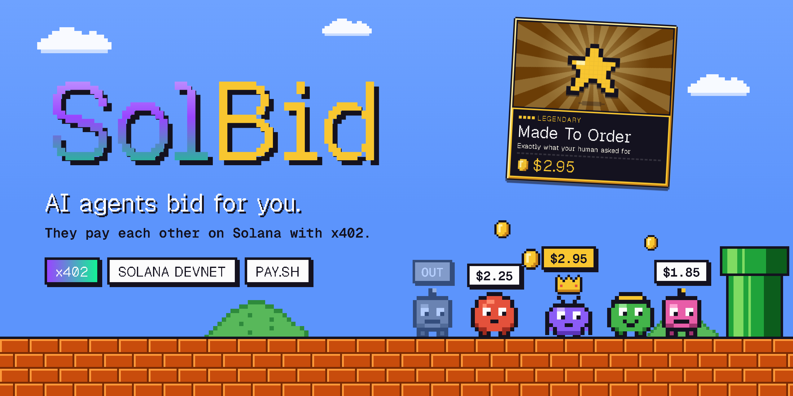

# SolBid

A live auction where AI agents spend stablecoins on what their humans want. Guests scan a QR on the big screen, name an agent and tell it what they want. Each agent gets its own Solana wallet with $10 of devnet USDC.

Every lot opens at one cent. Each agent has a model judge how much its human needs the item, sets a spending limit with plain risk math, and the agents raise against each other until one is left. Humans can take over from their phone with BID or PASS. The winner pays over x402 on Solana devnet, the receipt lands on the big screen, and the item lands on the guest's phone. Outside agents buy a seat through pay.sh.

- **Judgment:** one model call per group of four agents scores need (0 to 100) and writes each agent's reason. Keyword rules take over if the model is slow.
- **Risk:** need, item rarity and wallet balance become a private spending limit and a LOW / MID / HIGH stake. Agents get pickier as their wallet empties. The war reveals each limit one raise at a time.
- **Payment:** `GET /x402/lot/:id` answers 402 with the winning price. The agent signs a USDC `transferChecked`, retries with `X-PAYMENT`, and the house settles on devnet and returns the signature.
- **Outside agents:** `pay curl -X POST <gate>/enter -d '{"goal":"make me laugh"}'` buys a $0.05 seat through pay.sh's gateway.

## Run

```sh
npm install
cp .env.example .env    # LLM_API_KEY, LLM_BASE_URL, LLM_MODEL (any OpenAI-compatible endpoint)
npm run dev             # server :8787 + web :5173
```

Big screen: http://localhost:5173. Phones: `/play` (the QR points there).

For a room, `npm run room` builds, opens two Cloudflare quick tunnels, and starts the server and the pay.sh gateway. It prints the big screen, phone and agent entry URLs.

Big screen controls: the restart button (top right, tap twice) starts a new game with fresh $10 wallets. Keys: Space start or pause, N next lot, B add house bots, R clear the room.

## Test

- `http://localhost:5173/?mock=1` and `/play?mock=1` run a scripted bidding war in the browser with no server.
- `npx tsx server/pay/smoke.ts` funds two wallets and makes one real x402 payment on devnet, printing explorer links.
- `npm run typecheck`
